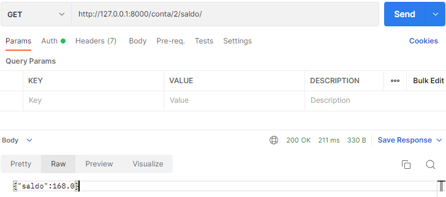
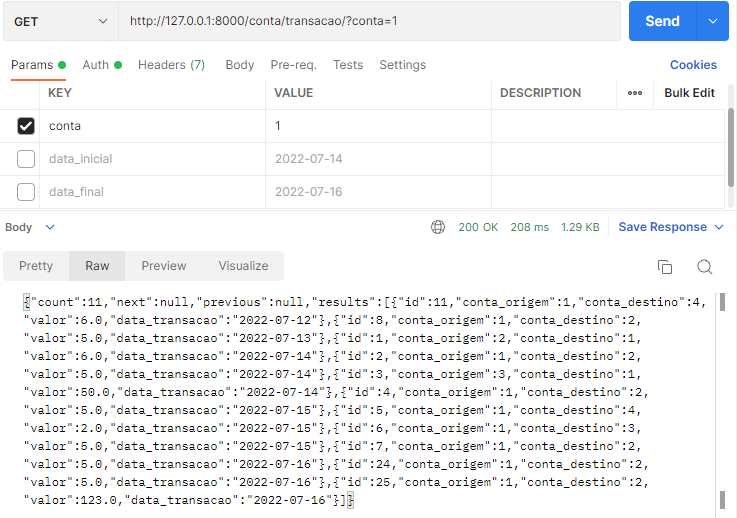

# Bootcamp Python Código[s] 
# Desafio Semifinal 	:rocket:

Stone e How Bootcamps :green_heart:

#### Descrição do desafio:
Criar uma API REST com sistema similar a um banco digital. Deve permitir:
<ul>
  <li>A criação de uma nova conta</li>
  <li>Consulta de todas as contas criadas</li>
  <li>Consulta de saldo de uma conta</li>
  <li>Transferência de saldo entre contas</li>
  <li>Consulta das transferências de uma conta (recebidos e enviados), com possibilidadede consultar em um dado período estipulado</li>
</ul>

[Maiores detalhes](arquivos_readme/desafio.pdf)

#### 1. Considerações iniciais:
Por motivos externos, houve abandono do projeto inicial e uma nova produção em curto prazo de tempo. Em vista deste problema, foram criados modelos bem simples, de forma a economizar tempo com o tratamento de dados não necessários para a efetivação das funcionalidades requeridas pelo desafio.

#### 2. Database e .env:
Necessário um arquivo .env com dados de conexão com um BD (mySQL), bem como a existência do DB. No mesmo arquivo deve constar o campo de SECRET_KEY para o Django.
        
        SECRET_KEY='[secret key]'
        ENGINE='mysql'
        NAME='[nome do bd]'        
        USER='[nome do usuário do bd]'        
        PASSWORD='[senha do usuário]'        
        HOST='[ip do host]'        
        PORT='[porta de acesso]'

Porém, é possível também alterar o settings.py para o padrão inicial, que gera um squlite:

        DATABASES = {
            'default': {
                'ENGINE': 'django.db.backends.sqlite3',
                'NAME': os.path.join(BASE_DIR, 'db.sqlite3'),
            }
        }

#### 3. Autenticação:
Foi aplicado sistema de autenticação e permissão básicos de forma generalizada, nas configurações do settings.py.

        REST_FRAMEWORK = {
            'DEFAULT_FILTER_BACKENDS': ['django_filters.rest_framework.DjangoFilterBackend'],
            'DEFAULT_PAGINATION_CLASS': 'rest_framework.pagination.PageNumberPagination',
            'PAGE_SIZE': 20,
            'DEFAULT_PERMISSION_CLASSES':[
                'rest_framework.permissions.IsAuthenticated',
                'rest_framework.permissions.DjangoModelPermissions'
            ],
            'DEFAULT_AUTHENTICATION_CLASSES':[
                'rest_framework.authentication.BasicAuthentication',
            ]

        }

#### 4. Sobre os Models:
Foram criados apenas dois modelos: Conta e Transacao. Ambos possuem um atributo “id” que serve como chave primária.

<b>Conta</b> possui outros dois atributos:
<li>cliente, para receber o nome do cliente desta conta; 
<li>saldo, para receber o valor inicial do saldo da conta.

Uma melhoria clara se houvesse maior tempo seria criar um modelo de cliente, com diversos dados (nome, cpf, endereço etc.), e usar uma chave estrangeira em Conta para ligar com Cliente, bem como adicionar um campo de data da criação da conta.
 
<b>Transacao</b> possui, além do id, quatro campos: 
<li>conta_origem, que identifica o id da conta que irá efetivar a transferência;
<li>conta_destino, que identifica o id da conta que receberá a transferência; <li>valor, que determina o valor a ser enviado; 
<li>data_transacao, que registra o momento da transferência.

 
A data_transacao possui um valor padrão que identifica a data atual no momento do POST. Porém, ainda pode receber outros valores. Isto foi feito desta forma para poder simular transações em outros momentos.
Uma melhoria desejada era utilizar um campo de “Datetime”, para registrar os horários da transação, não apenas o dia.

#### 5. Sobre os Views:
Há quatro Views no sistema, com respectivos registros de routers e paths no urls.py do projeto:

##### ContaViewset

 
Um viewset simples com utilização do modelo Conta. Através do recurso na URL “criarconta”, é possível usar o GET para obter a lista de contas criadas e o POST para criar uma nova conta.

##### TransacaoViewset

 
Um viewset simples com utilização do modelo Transacao. Através do recurso na URL “criartransacao”, é possível usar o GET para obter a lista de transacoes criadas e o POST para criar uma nova transacao.

##### SaldoAPIViews

 
View que irá retornar o saldo de uma conta especificada na própria URL, que identificará a chave primária da conta. Para tanto, um GET deve ser feito no recurso “conta/<int:pk>/saldo/”, como, por exemplo “conta/2/saldo/” para retornar o saldo da conta de id=2.

##### TransacaAPIView

 
Este view foi criado para ser usado como filtragem e registrado como recurso com a URL “/conta/transacao/”. Ele ordena as transações em ordem crescente pela data que ocorreu. Um GET sem qualquer parâmetro irá retornar todas as transações, mas é possível aplicar três parâmetros, em conjunto ou separado:

<li><b>conta</b>: irá filtrar pelo id da conta
<li><b>data_inicial</b>: irá filtrar transações ocorridas a partir da data passada (incluída)
<li><b>data_final</b>: irá filtrar transações ocorridas até a data passada (incluída)

Por exemplo, se quisermos as transações recebidas e enviadas pela conta de id 1, no período de 10/07/2022 a 12/07/2022, usamos o recurso na seguinte forma: /conta/transacao/?conta=1&data_inicial=2022-07-10&data_final=2022-07-12

#### 6. Sobre os Serializers:

Foram criados três serializers:
##### ContaSerializer

Serializer simples aplicado para o view ContaViewset. Faz o tratamento de validação dos atributos do modelo.
##### SaldoSerializer

Serializer simples aplicado para o view SaldoAPIView. Não validações de atributos do modelo aqui, já que serva apenas para um GET simples de dados já gerados e validados em outros momentos.

##### TransacaoSerializer

Este serializer está sendo utilizado tanto para o view TransacaoViewset como para o TransacaoAPIView.
Ele faz a validação dos atributos do modelo Transacao. Com dados validados, irá efetuar o registro da transação e fazer as alterações no Database, retirando o valor da transferência da conta origem e adicionando à conta destino.

#### 7. Sobre os Validators:
Os validators são apenas arquivos criados por organização, para desafogar o código dos serializers e gerando possibilidade de reuso do código com o crescimento futuro deste.
Foram separados em dois arquivos, aglomerando funções utilizadas para fazer o tratamento dos dados da conta e dos dados da transação.
##### conta_validator.py

Temos duas funções para validação de uma conta. A primeira é uma validação do cliente, ou seja, o nome. Basicamente checando se não foram utilizados numerais ou caracteres especiais. O campo em branco já possui tratamento/impedimento pelo próprio Django e DB.
A segunda função valida o saldo, evitando que se coloque um valor negativo. Foi permitido que o saldo seja zerado na criação da conta (inclusive, é o default caso o valor seja null).
##### transacao_validator.py  

Há rês funções de validação. A primeira valida as contas de origem e destino: checa sua existência e evita que se faça uma transação para a mesma conta. Uma melhoria futura seria separar outra função, apenas para checar a existência de uma conta, reduzindo o código.
A segunda função irá checar o valor da transação, impedindo transações com valores nulos, negativos ou que ultrapassem o saldo da conta de origem.
A terceira função checa se a data da transação é válida usando um Regex como padrão. Lembrando que o modelo usa valor default para usar a data atual, mas houve uma preferência de permitir que o usuário determine a data da transação para poder criar transações em dias diferentes e testar a API de forma mais ampla.

#### 8. Sobre os Tests:
Os testes foram separados em três arquivos, a maioria testando status code em relação a conta, a transação (criar e listar todas) e ao filtro de transação (GET com parâmetros de conta e datas).
Ao todo foram criadas apenas 14 funções de testes e eles foram feitos posterior ao código fonte. A não utilização do TDD foi por motivos externos (pressa, falta de tempo, doença), que geraram dúvidas se seria possível terminar o projeto. Assim, houve um foco em criar o sistema e suas funcionalidades, deixando validações, tratamento de erros e testes para o final, se sobrasse tempo suficiente.
Há um padrão nos arquivos de testes que é o uso de fixturing. Houve tanto o uso de um arquivo com dados para alimentar um Database de teste, contendo 3 contas e 9 transações, como a criação de um superuser e uma instância de APIClient para simular o consumo da API.

 
O "db_para_testes" é um arquivo .json que trás os dados dos objetos mencionados. O primeiro teste serve justamente para checar se estes dados foram carregados no DB de teste.
Estes dados simulados são muito úteis em certos testes, como, por exemplo, quando é necessário testar o filtro de transações (sem filtro; com filtro de conta; com filtro de conta, data inicial e final), como pode ser visto abaixo:

#### 9. Usando as funcionalidades:

Para a demonstração das funcionalidades requeridas pelo desafio, será utilizado a aplicação Postman. Lembrando que houve uso de autenticação básica (e permissão) para toda a API. Sem informar credenciais válidas, qualquer recurso irá retornar status code 401 (não autorizado).

 
Para a demonstração, criou-se a conta de superuser abaixo, que será utilizada em todos os exemplos abaixo:

 

##### a) Criação de uma nova conta
Para criar uma nova conta, fazemos o request com método POST para o host (local host, no teste acima), no recurso “/criarconta/”. Os dados enviados devem constar o nome do cliente e o saldo.

 
Parâmetros inválidos retornam exceções. Por exemplo, tentativa de cadastrar conta com saldo negativo:

 

##### b) Consulta de todas as contas criadas
A consulta de todas as contas criadas é feita no mesmo recurso de criação (“/criarconta/”), com uso do método GET.

 
Observar que houve configuração no framework para paginação de vinte objetos por página. Assim, se o total das contas ultrapassar, para acessar as outras páginas, deve ser enviado um parâmetro referente à página seguinte.

 

##### c) Consulta de saldo de uma conta
Para a consulta de saldo, basta usar o método GET no endpoint “conta/<id>/saldo/”, onde o id representa a conta a se obter o saldo. A princípio, foi experimentado retornar diretamente o valor. Porém, para manter um padrão nos dados, alterou-se para retornar na forma de dicionário.

##### d) Transferência de saldo entre contas
Para usar o recurso de transferência entre contas, criamos uma nova transferência com o método POST no recurso “criartransacao”, enviando os dados necessários (conta_origem, conta_destino, valor, data_transacao).

##### e) Consulta das transferências de uma conta (recebidos e enviados), com a possibilidade de consultar em um dado período estipulado
A consulta das transferências ocorre pelo endpoint “conta/transacao/” através do método GET. Ao utilizar sem qualquer parâmetro, irá retornar todas as transações no DB. 

 
Há três parâmetros que podem ser usados como filtro: conta, data_inicial e data_final. Podem ser usados juntos ou isolados.

 

